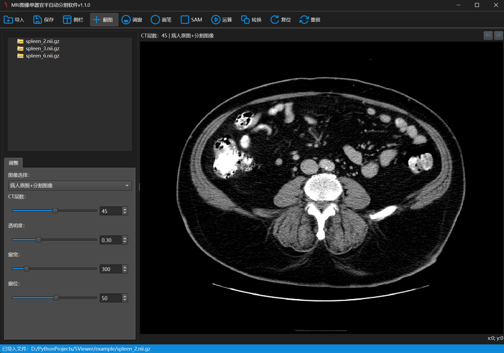

# [SViewer] - 基于 Segment Anything Model 2 的医学图像交互式标注软件

[](https://pypi.org/project/PySide6/) [](https://www.python.org/) [](LICENSE)



## 项目简介

SViewer 是一个基于 PySide6 框架开发的跨平台桌面应用程序，专为处理 nii.gz 格式的医学图像设计。该软件提供了强大的功能来显示、调整窗宽窗位（调窗）和对医学图像进行标注。结合Segment Anything Model 2 的强大能力，用户可以实现高精度的自动分割与手动精细调整相结合的高效标注流程。

**功能特性**
✅ 图形界面交互
✅ 医学图像显示与调窗
✅ 医学图像标注与编辑
✅ SAM 模型支持的智能标注分割

**文件结构**

```bash
├─.vscode
├─app
├─docs
├─example
├─icons
├─model
├─widgets
```

## 安装教程

### 快速开始

请按照以下步骤设置您的环境并运行 SAMS：

首先下载[sam2.1_hiera_base_plus](https://huggingface.co/mabote-itumeleng/ONNX-SAM2-Segment-Anything/tree/main)的enconder和deconder文件，将他们放置在model文件夹下即可

```bash
# 克隆仓库到本地
git clone https://github.com/cjf128/SAMS.git
cd SAMS

# 创建并激活虚拟环境（以conda为例）
conda create -n sams python=3.10
conda activate sams

# 安装依赖包
pip install -r requirements.txt

# 下载必要的模型配置文件，并将其放置在项目的model目录下

# 运行程序
python main.py
```

# 数据集下载

https://www.kaggle.com/datasets/oldyan/task09-spleen

# 参考:

SAM2 Repository: https://github.com/facebookresearch/segment-anything-2

ONNX-SAM2-Segment-Anything: https://github.com/ibaiGorordo/ONNX-SAM2-Segment-Anything

---
