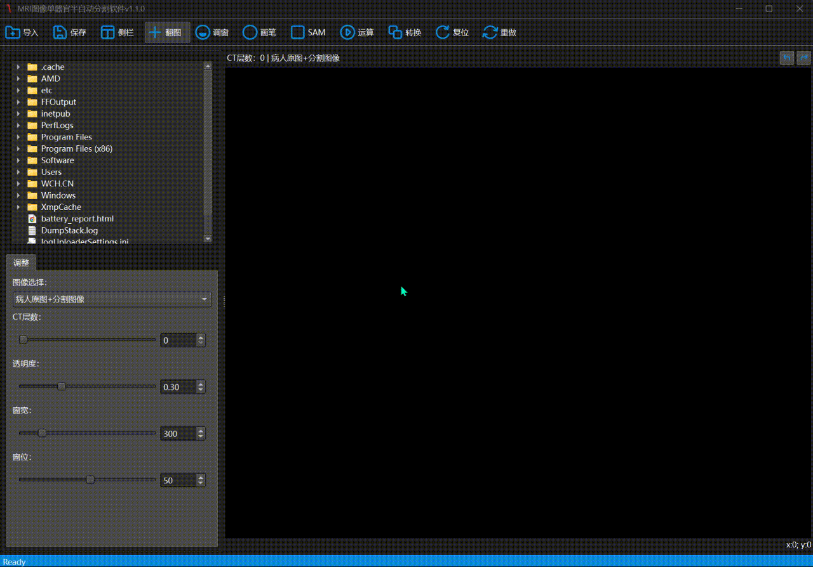

# 使用说明

## 工具栏功能
1. 保存：点击后，将处理后的nii图像文件保存在指定路径。

2. 侧栏：点击后，可显示/隐藏副命令操作区。

3. 翻图：当该按键被选中时，可改变图像在图像显示区的位置。

4. 调窗：当该按键被选中时，可以通过鼠标在图像显示区上的移动调整亮度和对比度。

5. 画笔：当该按键被选中时，可以在图像显示区对原图像进行标注。

6. SAM：点击后，可以通过鼠标在图像显示区画框。

7. 运算：在使用SAM画框后点击，即可将图像画框区域进行分割。

8. 转换：点击后，转换图像显示的位面。

9. 复位：点击后，图像恢复原本大小并居中显示。

10. 重做：点击后，将清除图像所有已标注区域。

## 侧栏
1. 上层为文件管理层，可通过文件管理器导入图像数据。

2. 层为设置层，可以切换图像类型，调整图像的层数、透明度、窗宽窗位。

## 图像区
